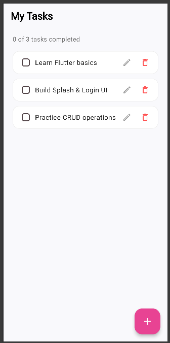
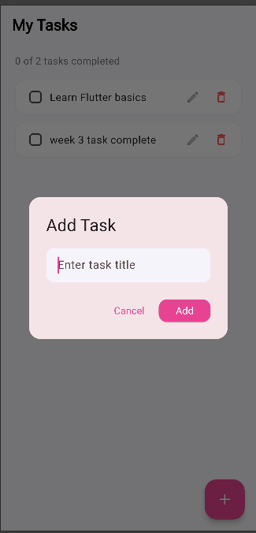
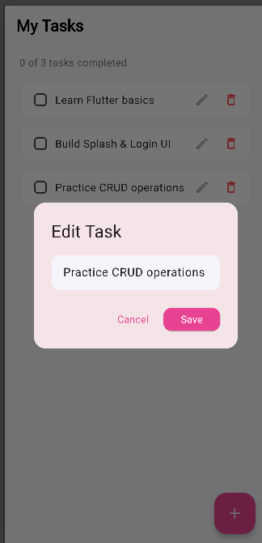
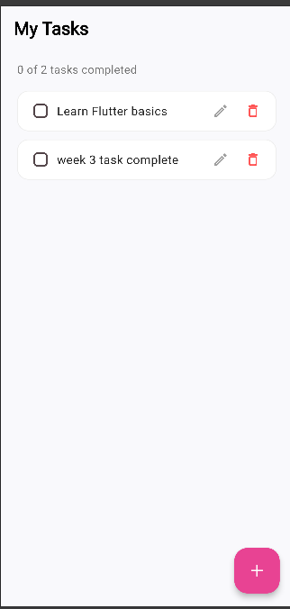

# Flutter Development Internship — Week 3

A To-Do List app implementing full CRUD (Create, Read, Update, Delete) operations on local in-memory data.

## ✅ Features

- **Add a Task** — tap the `+` floating button, type a title, tap Add
- **Edit a Task** — tap the edit (pencil) icon on any task
- **Delete a Task** — tap the delete (trash) icon on any task
- **Mark as Completed** — tap the checkbox next to a task (strikes through the title)
- **Display tasks** — using `ListView.builder` for efficient list rendering

## 🗂️ Project Structure

```
lib/
├── main.dart                # App entry point
├── models/
│   └── task.dart            # Task data model (title, isCompleted)
├── screens/
│   └── todo_screen.dart     # Main To-Do screen with CRUD logic
└── widgets/
    └── task_tile.dart       # Reusable widget for a single task row
```

## 🎨 Topics Covered

- **Dart List** — tasks are stored in a local `List<Task>`
- **ListView.builder** — efficiently renders the task list
- **setState()** — used for state management (adding/editing/deleting/toggling tasks triggers a UI rebuild)
- **CRUD Operations** — Create (`_addTask`), Read (`ListView.builder` over `_tasks`), Update (`_editTask`, `_toggleComplete`), Delete (`_deleteTask`)

> Note: State is currently managed with `setState()`, which keeps everything local to `TodoScreen`. A natural next step is migrating this to the **Provider** package so task state can be shared/accessed from other screens without passing data manually.

## 🚀 Getting Started

1. Clone this repository
2. Run `flutter pub get`
3. Run `flutter run`

## 📸 Screenshots

| Home Screen | Add Task | Edit Task |
|---|---|---|
|  |  |  |

| Delete Task | Completed Task |
|---|---|
|  |  |

## 📅 Week 3 Tasks Completed

- [x] Create a To-Do App
- [x] Add a Task
- [x] Edit a Task
- [x] Delete a Task
- [x] Mark a Task as Completed
- [x] Display tasks using ListView.builder
